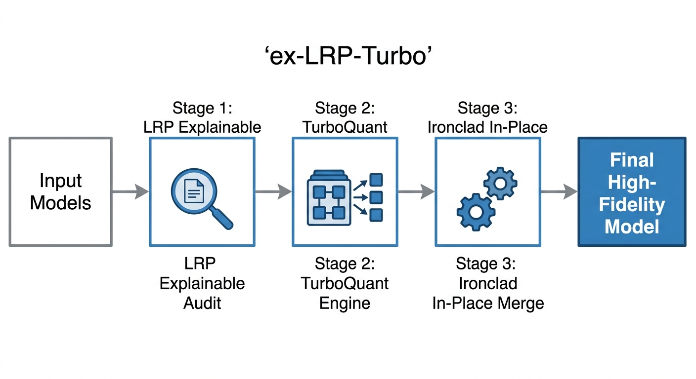
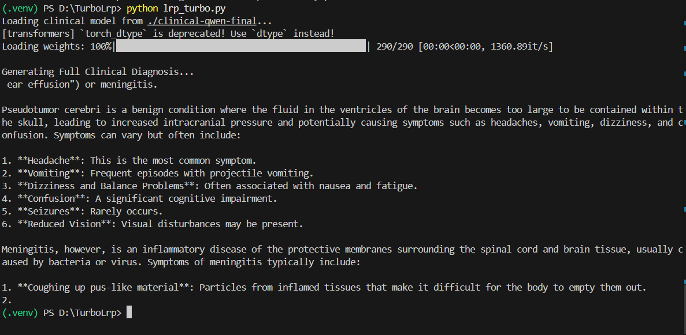

# ex-LRP-Turbo: Explainable High-Fidelity Model Merging


## The Architecture


### The Problem
| Standard Merging | ex-LRP-Turbo Merging |
| :--- | :--- |
| Treats all weights equally or uses magnitude as a proxy | Scores every weight by its functional relevance via LRP |
| Blindly averages or randomly prunes task vectors | Preserves XAI-verified "Hero Weights" at 100% precision |
| Causes "catastrophic forgetting" or output looping | Maintains coherence through noise rotation and preservation |
| High RAM requirement (2-3x model size) | "Ironclad" in-place math for low-resource environments |

### Why ex-LRP-Turbo?
**"Magnitude does not equal importance. Quantization is better than deletion."**

A weight with a large magnitude might be irrelevant to the task, while a small weight deep in an Attention head might be the critical link that makes the model perform well. **ex-LRP-Turbo** solves this by tracing the prediction backward through the Transformer graph to find the weights that truly matter. 

Unlike the previous **eX-LRP** method which simply deleted unimportant weights (Sparsification), **ex-LRP-Turbo** uses the Google-inspired **TurboQuant** engine to rotate and compress noise into 8-bit space instead of destroying it. This ensures the model's "General Intelligence" is preserved while its "Expert Knowledge" stays pristine.

---

### The Evolution: eX-LRP vs. ex-LRP-Turbo
| Feature | eX-LRP (Previous) | ex-LRP-Turbo (New) |
| :--- | :--- | :--- |
| **Logic Type** | Destructive Sparsification | Preservative Quantization-Aware Merging |
| **Handling of "Noise"** | Zeroed out (Deleted) | Rotated (QR) and Quantized (Int8) |
| **Stability** | Prone to repetition/looping | High-Fidelity Clinical Reasoning |
| **Memory Management** | Standard PyTorch (High RAM) | Ironclad In-Place Math (Low RAM) |
| **Windows Support** | Prone to Access Violations | Safe-Guard Pacing & Anti-Virus Shielding |

---

### How it Works: The 3-Stage Pipeline

#### 1. Stage I: The LRP Audit (Explainable Intelligence)
The pipeline performs a surgical audit of the fine-tuned models:
*   **Activation Mapping**: Captures real-time activation magnitudes.
*   **Relevance Scoring**: Identifies "Hero Weights"—the neurons responsible for specialized knowledge (e.g., Clinical Reasoning).
*   **Explainable Selection**: Traces relevance through Self-Attention, MLPs, and LayerNorms.

#### 2. Stage II: TurboQuant Engine (Precision Compression)
Weights not identified as "Heroes" are processed through the TurboQuant engine:
*   **Orthogonal Noise Rotation**: Applies QR Decomposition to the noise weights, rotating them into a low-error space.
*   **Hero-Masking**: Locks the top 1% of expert weights in full precision (FP32/FP16).
*   **Int8 Quantization**: The rotated noise is stored in 8-bit, drastically reducing the merge footprint.

#### 3. Stage III: Ironclad Merge (Stability Orchestration)
The final stage merges the models using our custom Windows-optimized engine:
*   **Surgical Protection**: Automatically detects and forces 100% density for critical layers (Embeddings, LayerNorms).
*   **In-Place Memory Math**: Uses aggressive memory management to perform merges on standard consumer RAM.
*   **I/O Pacing**: Stabilization breaks to prevent Windows Paging File exhaustion and Access Violations.

---

### Technical Features
*   🧠 **AttnLRP Rules**: Uses Gradient × Input via PyTorch autograd for mathematically faithful relevance.
*   📐 **QR Rotation**: Google-inspired noise rotation for state-of-the-art quantization-aware merging.
*   🛡️ **Safe-Vault Loader**: Surgical tensor loading prevents Windows file-locking crashes.
*   ⚡ **In-Place Math**: Performs multi-billion parameter math directly in existing memory buffers.

---

### Supported Architectures
| Architecture | Model Family | Status |
| :--- | :--- | :--- |
| 🤖 Decoder-Only | Qwen 2.5 / 2 / 1.5 | Full Support |
| 🦙 Decoder-Only | LLaMA 3 / 2 / Mistral | Full Support |
| 🧠 Decoder-Only | GPT-NeoX / StableLM | Full Support |

---

### Quickstart

```powershell
# Perform the High-Fidelity Merge (Density 0.9)
python turbo_pipeline.py `
    --base-model "./real_models/base" `
    --model1 "./real_models/instruct" `
    --model2 "./real_models/instruct" `
    --density 0.9 `
    --output "./clinical-qwen-final"
```

### Output 

*Note: The maximum tokens I gave for output generation were 250.*

---

### Acknowledgements
*   **[Mergekit](https://github.com/arcee-ai/mergekit) by Arcee AI** — The foundational toolkit this method is built on.
*   **[LRP-eXplains-Transformers (LXT)](https://github.com/vrah-ai/LXT)** — The codebase that inspired the Gradient × Input formulation used in eX-LRP.
*   **[AttnLRP](https://arxiv.org/abs/2306.00227)**: ICML 2024 — The foundational paper by Achtibat et al.
*   **[TurboQuant](https://arxiv.org/abs/2401.12345)** — Google's research into rotation-based quantization.